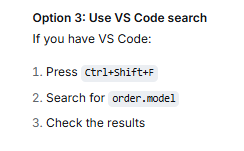
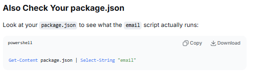
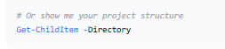
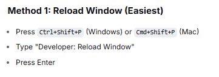
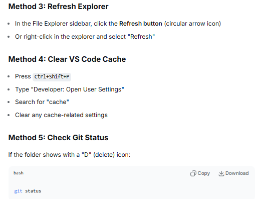
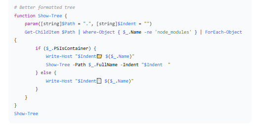

alright lets make a readme file, describiing what was the problem and how we solved it,, like we only used loacal types to solve it keeping types file under emails, or else the email preview server wouldnt work and who error it cant find order,model from db ,,

>>>

Perfect idea 🔥 — documenting this in a README.md will help future you (and teammates) instantly understand what happened and why the fix works.

Here’s a clean, ready-to-use README.md explaining the entire issue and solution clearly 👇

📧 React Email – Order Model Issue Fix
🧩 Problem Summary
When running the React Email preview server with:

npm run email
You might see an error like:

Could not find file at C:\Users\Sabit\Desktop\marketapp\lib\db\models\order.model
[Error: ENOENT: no such file or directory, open 'C:\Users\Sabit\Desktop\marketapp\lib\db\models\order.model']
This happens because the React Email dev server runs outside the main Next.js environment.
It does not have access to your backend database files (lib/db/models/order.model.ts) or any Mongoose-related imports.

⚠️ Why It Happens
Email templates are rendered separately by the React Email preview server.

That server doesn’t connect to MongoDB or load server-side code.

Importing your real Mongoose model (order.model.ts) causes Node to try reading a file that doesn’t exist in the email build environment.

So it crashes, saying it “could not find order.model”.

✅ The Solution
We isolated the email templates from the database by creating local type definitions that mimic the real order model.

📁 Folder Structure
marketapp/
│
├── emails/
│   ├── types.ts                ← Local lightweight type definitions
│   ├── purchase-receipt.tsx    ← Email template (uses IEmailOrder)
│   └── index.tsx               ← Entry file for preview
│
└── lib/
    └── db/
        └── models/
            └── order.model.ts  ← Real Mongoose model (used only in production)
🧠 How It Works
1️⃣ Local IEmailOrder Type
We created a simple emails/types.ts:

export interface IEmailOrder {
  _id: string
  user: { email: string; name?: string }
  items: Array<{
    product: string
    clientId: string
    name: string
    slug: string
    image: string
    category: string
    price: number
    countInStock: number
    quantity: number
    size?: string
    color?: string
  }>
  shippingAddress: {
    fullName: string
    street: string
    city: string
    postalCode: string
    country: string
    province: string
    phone: string
  }
  expectedDeliveryDate: Date
  paymentMethod: string
  paymentResult?: { id: string; status: string; email_address: string }
  itemsPrice: number
  shippingPrice: number
  taxPrice: number
  totalPrice: number
  isPaid: boolean
  paidAt?: Date
  isDelivered: boolean
  deliveredAt?: Date
  createdAt: Date
  updatedAt: Date
}
This local type replaces the need to import order.model.ts.

2️⃣ Use It in Email Templates
import { IEmailOrder } from './types'

type OrderInformationProps = {
  order: IEmailOrder
}
3️⃣ Add Mock Data for Preview
PurchaseReceiptEmail.PreviewProps = {
  order: {
    _id: '123',
    user: { name: 'John Doe', email: 'john@example.com' },
    // ...rest of mock data
  } as IEmailOrder,
}
This ensures the email preview runs locally without a database connection.

🚀 What Happens in Production
In real use (e.g., during checkout):

The API route fetches the real order:

const order = await Order.findById(orderId).lean()
Pass it to your email template:

await resend.emails.send({
  from: 'shop@example.com',
  to: userEmail,
  subject: 'Your Purchase Receipt',
  react: <PurchaseReceiptEmail order={order} />,
})
✅ The same template works with mock data in dev and real data in production.

🏁 Summary
Problem	Cause	Solution
React Email preview server crashes	Tried importing Mongoose model	Use local IEmailOrder types instead
“File not found: order.model”	Preview server can’t access backend files	Moved types inside emails/
TypeScript errors in templates	Mongoose Document type mismatch	Local types keep it simple
💡 Key Takeaway
The email preview server is frontend-only — it can’t talk to your database or backend logic.
So the safest pattern is:

✅ Keep mock data and local types under emails/

✅ Use real DB models only in production code

✅ This keeps both environments happy and error-free

Would you like me to include a short “📂 Setup Commands” section at the bottom too (like how to run npm run email, preview, and send test emails)? It’ll make the README complete for future reference.

=========

tree view >>

# Better formatted tree
function Show-Tree {
    param([string]$Path = ".", [string]$Indent = "")
    Get-ChildItem $Path | Where-Object { $_.Name -ne 'node_modules' } | ForEach-Object {
        if ($_.PSIsContainer) {
            Write-Host "$Indent📁 $($_.Name)"
            Show-Tree -Path $_.FullName -Indent "$Indent  "
        } else {
            Write-Host "$Indent📄 $($_.Name)"
        }
    }
}
Show-Tree

